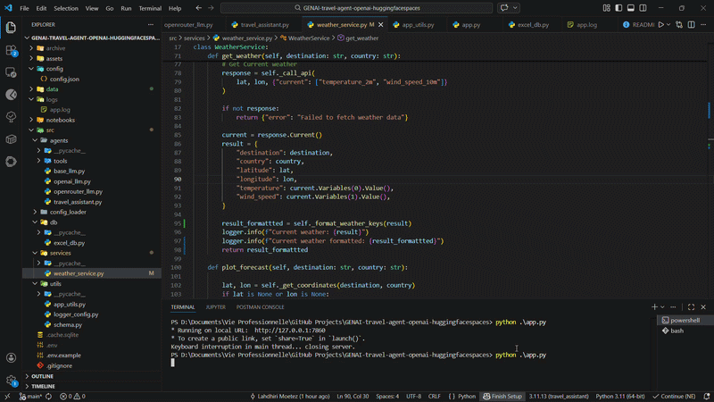

# AI Travel Assistant using Gradio

This project is a prototype of an **AI-powered travel assistant** capable of answering travel-related queries while leveraging external tools through **LLM tool-calling**.
The interface is built with **Gradio**, and the assistant can orchestrate multiple tools to retrieve real-world information.

**Supported LLM providers**
- OpenAI (`openai` library)
- OpenRouter (`requests` library)

**Integrated tools**
- Internal database tool (Excel-based)
- External weather API (Open-Meteo)
- Local MCP flight search server (AviationStack) built from scratch

---

# Tools Architecture

The assistant interacts with three different categories of tools, all implemented from scratch, illustrating common patterns used in LLM-based agent systems.

## Internal data source

The assistant can retrieve travel information from an internal Excel file ([destinations_infos.xlsx](data/destinations_infos.xlsx)). The dataset contains fields such as:

- `destination`
- `country`
- `keywords`
- `best_season`

This Excel file is used as a **simple internal structured data source**, but the architecture allows replacing it with other sources such as:

- a SQL database
- a vector database
- an internal REST API
- a larger structured dataset

The goal is to illustrate how an agent can query **internal structured knowledge**.

---

## External API tool

The assistant can retrieve **live weather information** using the [Open-Meteo API](https://open-meteo.com/). Open-Meteo is particularly useful because the API is free, requires no authentication, and provides a large set of weather endpoints. The current implementation retrieves:

- Current weather conditions
- Past weather data (3 days)
- Forecast data (3 days)

A weather plot is generated dynamically and displayed in the interface.

---

## MCP Server tool (AviationStack)

A local **MCP server** is implemented to expose a flight search tool using the [AviationStack API](https://docs.apilayer.com/aviationstack/docs/api-documentation). For now, the MCP server exposes the following tool:

- `search_flights`: retrieves scheduled flights between two airports (IATA codes) for today and tomorrow. Access to future flight data requires a paid plan.

> ⚠️ **Note (February 2026):**
> In this project the MCP server is implemented **mainly for demonstration purposes**. Since the server is built from scratch and used by a
> single agent, MCP does not provide a major advantage compared to exposing the tool through a traditional REST API (for example using
> FastAPI). MCP becomes more relevant when a team develops and maintains an MCP server that exposes a set of tools, and multiple users can
> connect their agents to that server. In that scenario, agents can dynamically discover and use the available tools without having to
> implement them locally in their own codebase. As of early 2026, there are still relatively few publicly available and free MCP servers that
> can be directly integrated into agent systems.

---

# Possible Enhancements

This project is intended as a **base architecture** for a more advanced travel assistant. Several extensions can be implemented:

- Extend the Open-Meteo integration to support additional endpoints such as hourly forecasts, precipitation data, climate statistics, or historical weather.
- Extend the AviationStack integration to include flight status, airport information, airline metadata, or route tracking (note that this requires a paid plan).
- Replace the Excel database with a more scalable backend such as SQL, a document store, or a vector database.
- Add new travel-related tools such as hotel search, tourist attraction discovery, visa requirements, currency conversion, or public transportation data.
- Dynamically enable or disable tools through a configuration file.
- Add additional LLM providers as long as they support **tool-calling / function-calling** methods.
